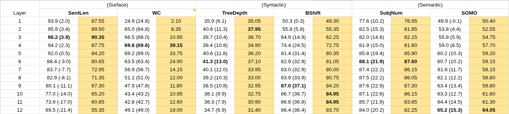
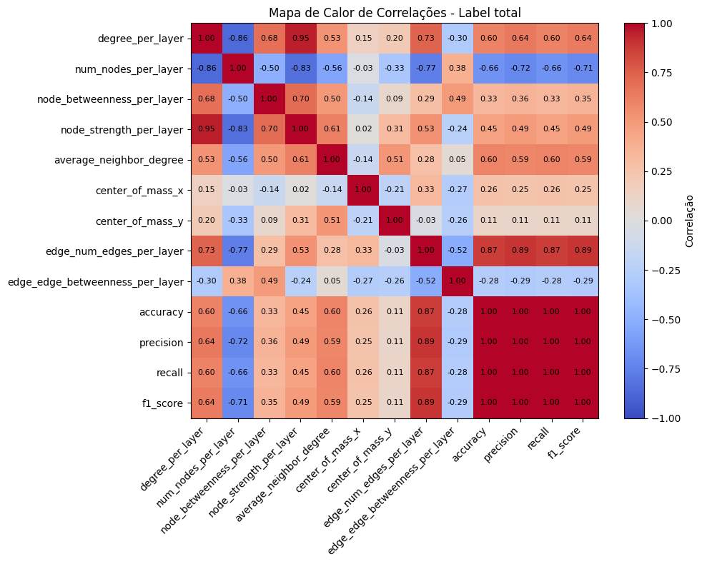
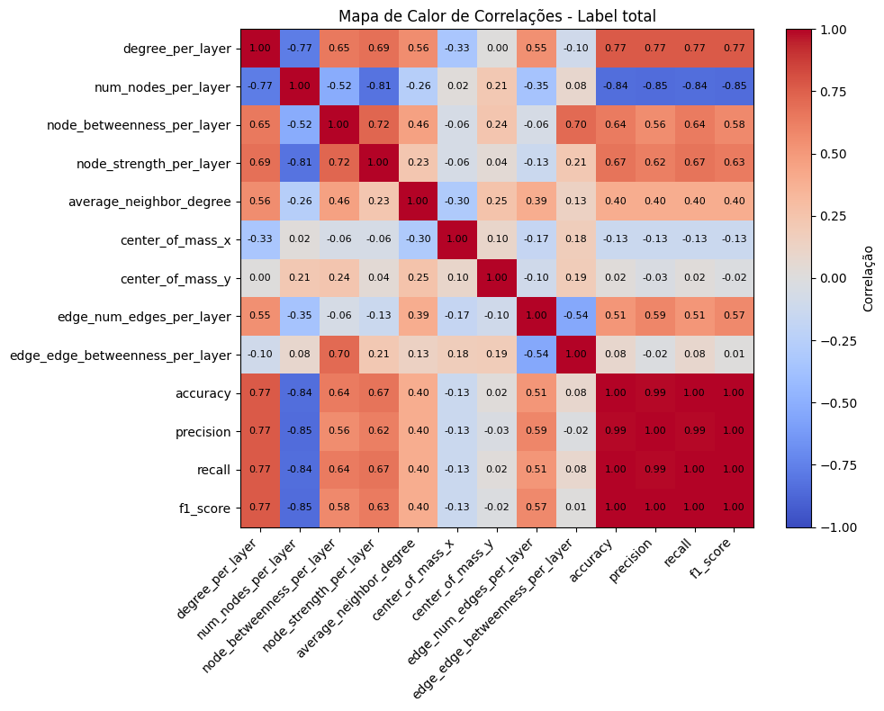
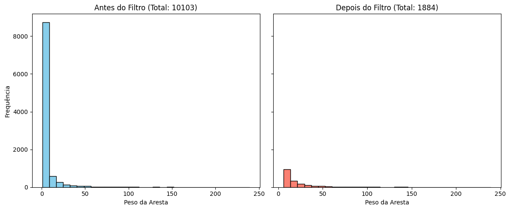
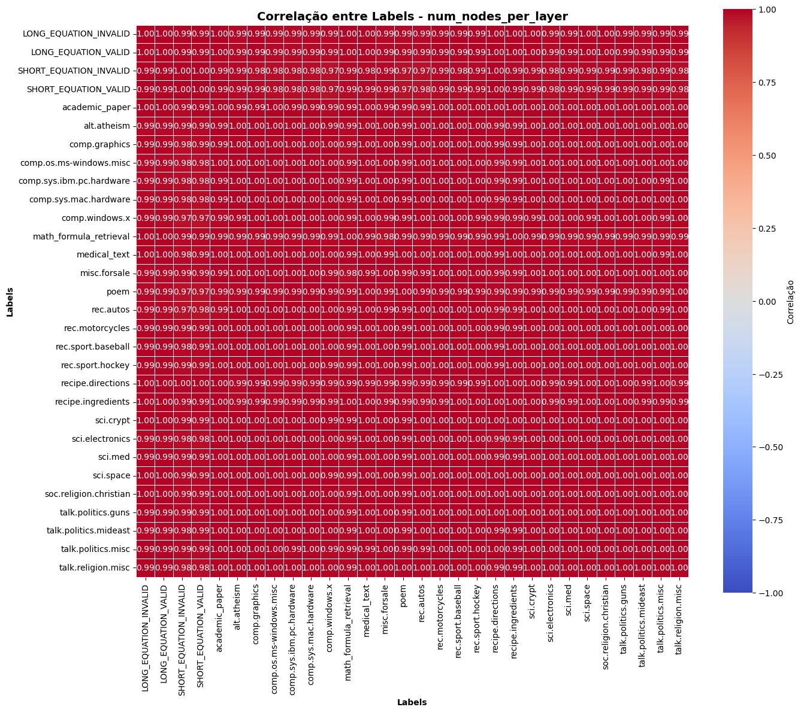
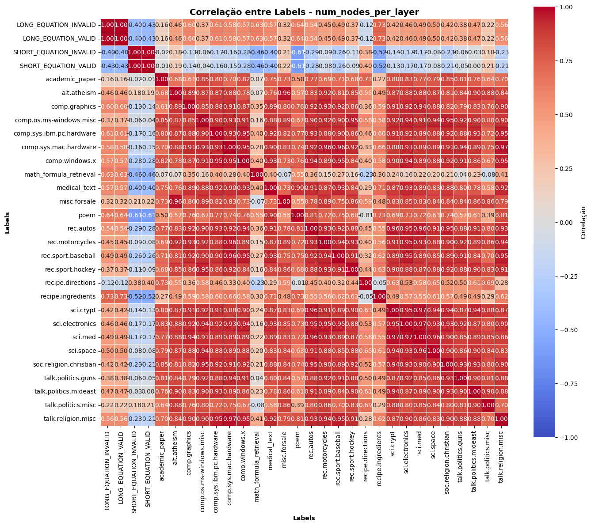
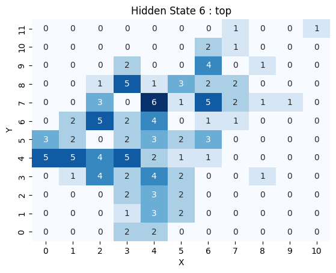
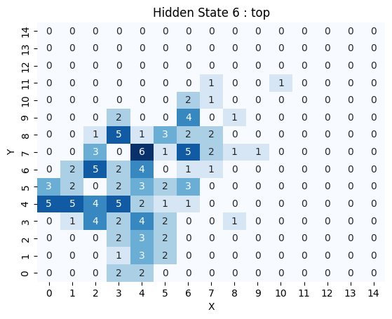
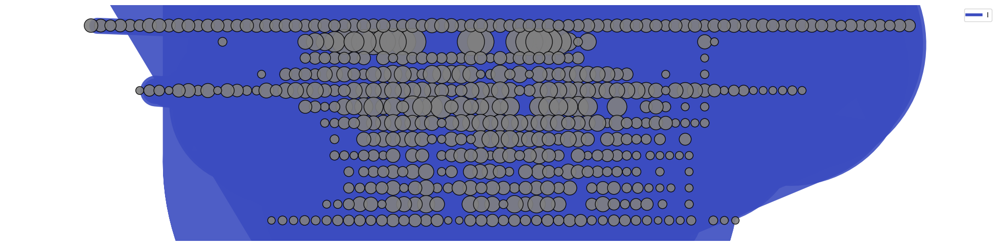

# Report 2026_05_12

<details>
<summary><h2>Experimento de Probing</h2></summary>

[Código relacionado](../probing/senteval/probing_senteval.ipynb)

Inspirado no artigo ["What does BERT learn about the structure of language?"](https://aclanthology.org/P19-1356/), que investiga como o BERT captura informações estruturais da linguagem.

> *If the auxiliary classifier can predict a linguistic property well, then the original model likely encodes that property.*

Usa o dataset [SentEval](https://github.com/facebookresearch/SentEval/blob/main/data/probing/README.md) com 10 tarefas de *probing* desenvolvidas pelo Facebook. Originalmente o dataset tem 120.000 entradas; no momento, estou usando somente 10.000.

A ideia aqui foi replicar o experimento "Probing Tasks" feito no artigo e, depois, acrescentar um estudo da correlação entre os resultados do *probing* e as métricas de redes complexas.

**Proposta:** O classificador determina quais camadas estão mais aptas a resolver um determinado problema. Se certas métricas acompanham essa curva, pode-se usá-las para entender como a topologia dos NRAGs conversa com a distribuição de conhecimento no modelo.

### Resultados do probing


### Correlação* *(A primeira camada ainda está sendo considerada)*:

**Dataset sentence_length**  


**Dataset subj_number** *(number of the subject of the main clause)*  


### Pontos de atenção:
* **Filtragem agressiva:** Estou fazendo uma filtragem agressiva — qualquer aresta com peso inferior a 5 é eliminada. Isso remove aproximadamente 80% das arestas. Foi necessário devido ao grande volume de dados, pois existiam inúmeras arestas com peso ínfimo quando comparado ao volume total da entrada.  

* **Métricas das redes:** Não foram observadas diferenças significativas entre as métricas de redes complexas para as *tasks* exploradas.

</details>

<details>
<summary><h2>Experimento em diferentes Dominios</h2></summary>

[Código relacionado](../distict_data/pile/structure.ipynb)


Após não encontrar diferenca significativa nas metricas de redes complexas, começamos a explorar datasets com informações de diferentes dominios:
Inicialmente com um [dataset de noticias](http://qwone.com/~jason/20Newsgroups/) devido a variedade de temas, posteriormente adicionamos texto de dominios mais diversos como poemas, receitas e equações.

**Proposta:** Entender como as métricas extraídas dos NRAGs se correlacionam para textos de diferentes domínios.  

Aqui ficou claro a necessidade de remover a primeira camada das analises. Como ela é muito distoante, ele esmaga os resultados das demais camadas quando normalizamos.

[Nós por Camada](../distict_data/pile/evolution_num_nodes_per_layer.html)  


[Nós por Camada Normalizados](../distict_data/pile/evolution_num_nodes_per_layer_normalized.html)   


A primeira camada também estava influenciado fortemente a correlação entre o comportamento das camadas.





```
Top 10 pares com maior correlação:
               label_1              label_2  correlacao
 LONG_EQUATION_INVALID  LONG_EQUATION_VALID    1.000000
SHORT_EQUATION_INVALID SHORT_EQUATION_VALID    0.995792
 comp.sys.mac.hardware   talk.religion.misc    0.970284
             sci.crypt              sci.med    0.969617
       sci.electronics              sci.med    0.966840
 comp.sys.mac.hardware   rec.sport.baseball    0.963726
           alt.atheism         misc.forsale    0.960947
 comp.sys.mac.hardware      rec.motorcycles    0.960542
             rec.autos              sci.med    0.959675
               sci.med            sci.space    0.958611

Top 10 pares com menor correlação:
               label_1                label_2  correlacao
SHORT_EQUATION_INVALID                   poem   -0.609632
  SHORT_EQUATION_VALID                   poem   -0.606401
  SHORT_EQUATION_VALID     recipe.ingredients   -0.523736
SHORT_EQUATION_INVALID     recipe.ingredients   -0.520065
  SHORT_EQUATION_VALID math_formula_retrieval   -0.458715
SHORT_EQUATION_INVALID math_formula_retrieval   -0.455339
 LONG_EQUATION_INVALID   SHORT_EQUATION_VALID   -0.429321
   LONG_EQUATION_VALID   SHORT_EQUATION_VALID   -0.429321
  SHORT_EQUATION_VALID           medical_text   -0.404760
SHORT_EQUATION_INVALID           medical_text   -0.404461
```

</details>

<details>
<summary><h2>Melhorias Realizadas na Biblioteca</h2></summary>

* **Adição de *seed*:** Implementada a *seed* na chamada do UMAP para garantir que os resultados sejam replicáveis (commit: `34dd9ef`).
* **Parâmetro `compact_view`:** Adicionado ao método `get_grid` para permitir a geração de grelhas com colunas ou linhas vazias (commit: `9615dc7`).

| Antes | Depois |
| :---: | :---: |
|  |  |

* **Ajuste no `max_length`:** Removido o valor fixo para o parâmetro `max_length` na função `tokenize`. Agora, o valor é definido automaticamente a partir do modelo utilizado (commit: `24dbc73`).
* **Aviso de truncamento:** Adicionado um *warning* para alertar quando existem entradas que superam o limite de tokens suportado pelo modelo (commit: `24dbc73`).

</details>

<details>
<summary><h2>Melhorias Futuras para a Biblioteca</h2></summary>

### 1. Uso de GPU
Atualmente, a documentação contém a seguinte observação:
> *"For now, we recommend to use 'cpu' as device. Further tests are going to be executed to ensure full 'gpu' compatibility."*

Para utilizadores externos, esta é uma grande barreira de entrada. Se gostariamos desse tipo de uso da bibliotca seria interessante proorizar essa melhoria.  
Segundo o Felipe, não foram realizados testes o bastante para validar esse caso de uso, a implementação inicial no UMAP também apresentou problemas.

### 2. Problema de truncamento
Para entradas que superam a capacidade de tokens do modelo (ou 512 tokens na versão antiga da lib), todo o conteúdo excedente é descartado.  
A depenter do uso da biblioteca pode ser interessante tratar esse problema de maneira mais robusta.
* **Detalhes:** Veja [truncation.MD](truncation.MD).
* **Estado atual:** Como medida paliativa, foi adicionado um aviso (*warning*) para que os utilizadores estejam cientes deste comportamento. 

### 3. Visualização de grafos com grande volume de dados
Ajustar a visualização de grafos quando processamos grandes volumes de dados.



### 4. Melhorias na documentação
Melhorar a documentação como um todo, existem muito detalhes não documentados, a exemplo:
* **GraphND (n_components != 2):** Os pesos do NRAGs são equivalentes ao coeficiente de correlação de Spearman. É possível filtrar as arestas utilizando um *threshold*.
* **Graph2D (n_components == 2):** Os pesos são equivalentes ao número de entradas que passaram por aquela aresta. Neste caso, não existe *threshold* ou filtro aplicado.

</details>
