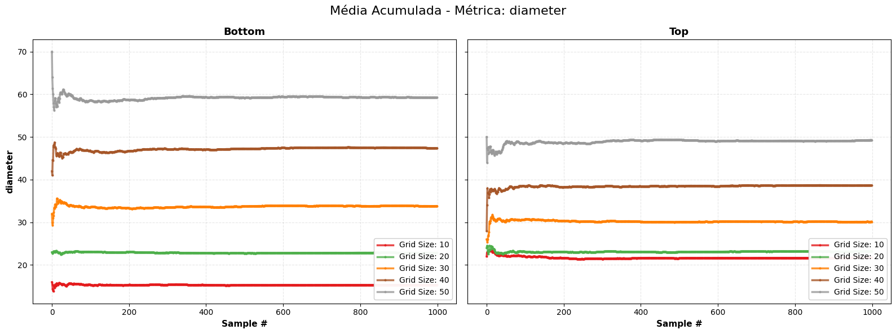

* Aparentemente o número de amostrar para estabilizar depende do modelo/entrada (há grande variação entre os diferentes aspecots explorados)

* Para valores menores de grid size parece haver uma maior variação

* Alguns grupos/metriccas parecem ser mais sensiveis as variações de grid size:

* Assortatividade parece ser mais caotica
